# Online French Cooking Club

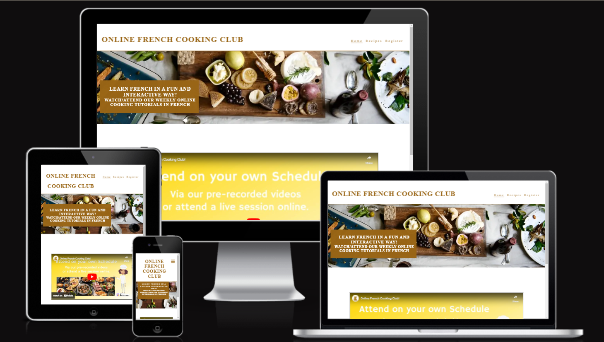

 

## Table of Contents
[Link to live website](https://thelanguagetribe.github.io/pp1-final-submission/)
- [Section 1: Introduction](https://github.com/Thelanguagetribe/pp1-final-submission?tab=readme-ov-file#section-1-introduction)
- [Section 2: User Experience](https://github.com/Thelanguagetribe/pp1-final-submission?tab=readme-ov-file#section-2-user-expereience) 
[i. Strategy Plane](https://github.com/Thelanguagetribe/pp1-final-submission?tab=readme-ov-file#i-strategy-plane)
- [Section 3: User Design](https://github.com/Thelanguagetribe/pp1-final-submission?tab=readme-ov-file#section-3-design) 
[ii. Scope Plane](https://github.com/Thelanguagetribe/pp1-final-submission?tab=readme-ov-file#ii-scope-plane) 
[iii. Structural Plane](https://github.com/Thelanguagetribe/pp1-final-submission?tab=readme-ov-file#iii-structural-plane) 
[iv. Skeletal Plane](https://github.com/Thelanguagetribe/pp1-final-submission?tab=readme-ov-file#iv-skeletal-plane) 
[Wireframes](https://github.com/Thelanguagetribe/pp1-final-submission?tab=readme-ov-file#desktop-wireframes) 
[v. Surface Plane](https://github.com/Thelanguagetribe/pp1-final-submission?tab=readme-ov-file#v-surface-plane) 
- [Section 4: Features](https://github.com/Thelanguagetribe/pp1-final-submission?tab=readme-ov-file#section-4-features) 
[i. Features of the Website](https://github.com/Thelanguagetribe/pp1-final-submission?tab=readme-ov-file#i-features-on-the-website) 
[ii. Features to be implemented in the Future](https://github.com/Thelanguagetribe/pp1-final-submission?tab=readme-ov-file#ii-features-to-be-implemented-in-the-future) 
- [Section 5: Technologies Used](https://github.com/Thelanguagetribe/pp1-final-submission?tab=readme-ov-file#section-5-technologies-used) 
[i.Main Languages](https://github.com/Thelanguagetribe/pp1-final-submission?tab=readme-ov-file#i-main-languages) 
[ii. Frameworks, Libraries & Programmes](https://github.com/Thelanguagetribe/pp1-final-submission?tab=readme-ov-file#ii-frameworks-libraries--programmes) 
- [Section 6: Deployment & Local Development](https://github.com/Thelanguagetribe/pp1-final-submission?tab=readme-ov-file#section-6-deployment--local-development) 
- [Section 7: Testing](https://github.com/Thelanguagetribe/pp1-final-submission?tab=readme-ov-file#section-7-testing) 
[Manual Testing](https://github.com/Thelanguagetribe/pp1-final-submission?tab=readme-ov-file#manual-testing) 
[Validator Tools](https://github.com/Thelanguagetribe/pp1-final-submission?tab=readme-ov-file#validator-tools) 
[i. Website Contrast Checker](https://github.com/Thelanguagetribe/pp1-final-submission?tab=readme-ov-file#website-contrast-checker) 
[ii. HTML Validator](https://github.com/Thelanguagetribe/pp1-final-submission?tab=readme-ov-file#html-validator) 
[iii. CSS Validator](https://github.com/Thelanguagetribe/pp1-final-submission?tab=readme-ov-file#css-validator) 
[iv. Lighthouse Reports](https://github.com/Thelanguagetribe/pp1-final-submission?tab=readme-ov-file#lighthouse-reports) 
- [Section 8: Credits](https://github.com/Thelanguagetribe/pp1-final-submission?tab=readme-ov-file#section-8-credits) 

## Section 1: Introduction
#### This project is..

## Section 2: User Expereience

### i. Strategy Plane
(user experiences) (market research- competitors + their websites aim:x3 competitor websites) (target audience)

(use enterprise Ireland research gathered- mention how it’s a part of your start-up idea).
User Stories (user profiles)
+link to online event macarons

## Section 3: Design

### ii. Scope Plane
-The Features I wanted in my website
-The features i got inspired from my competitors websites
(e.g. colour schemes, layouts, images)
(got ideas for website layouts using canva templates of websites- credit in teh credits section as well.)
-Functionality requirments I wanted

### iii. Structural Plane

Description of why you choose the layout you went with.

### iv. Skeletal Plane

Wireframes here
-responsiveness (mobiles, laptops and tablest)
•	(link) Wireframes for Mobile
•	(link) Wireframe for Tablet
•	(link) Wireframe for Desktop

### Desktop Wireframes
https://balsamiq.cloud/sj9vnze/ptrz8d9/rA818

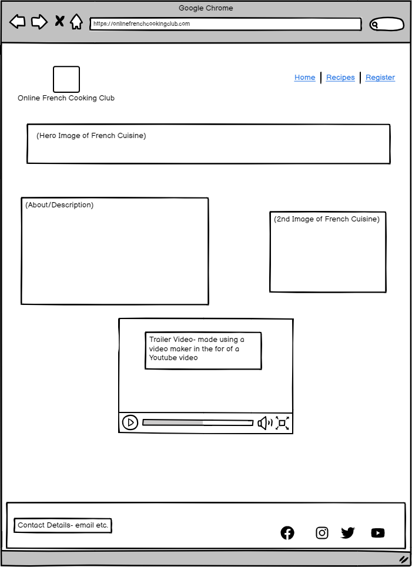

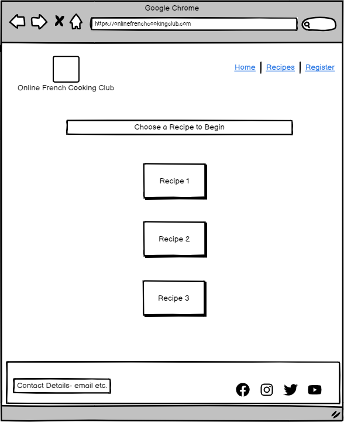

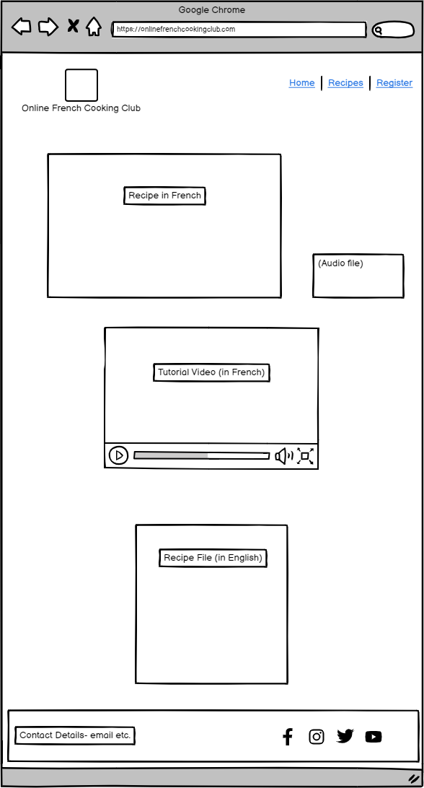

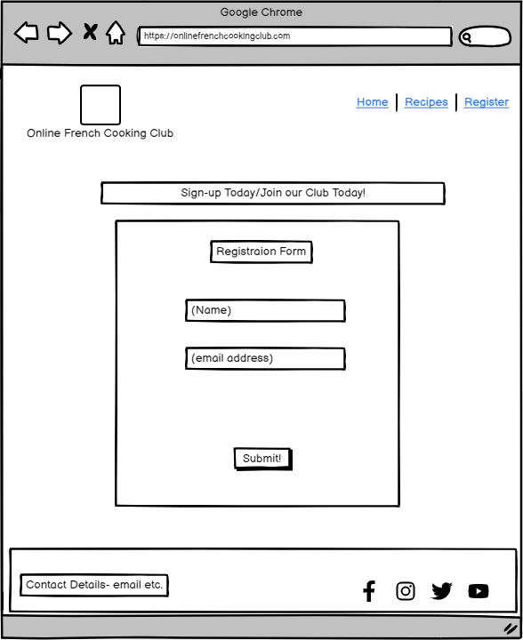

### Tablet Wireframes
https://balsamiq.cloud/sbqgqgv/pdf8jhp/r0E5E

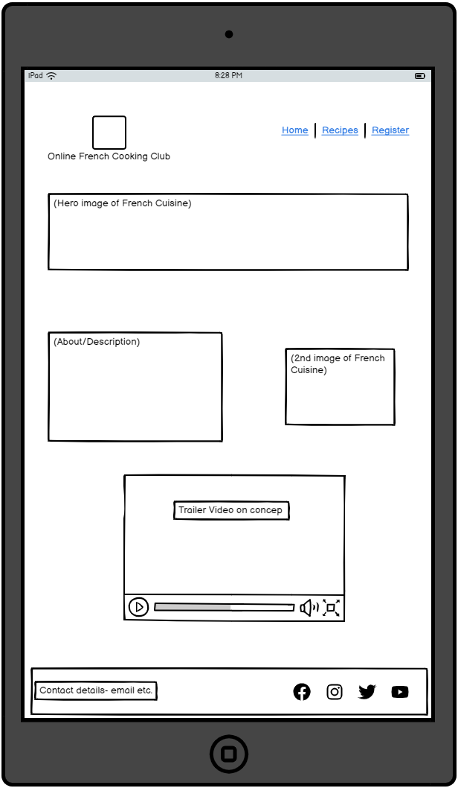

### Mobile Wireframes
https://balsamiq.cloud/sj9vnze/pho0yup

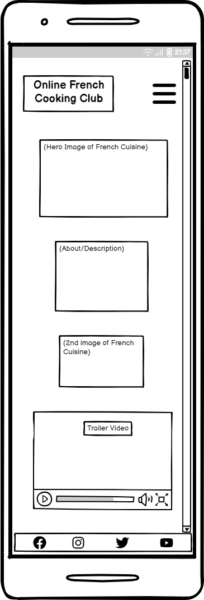

### v. Surface Plane

•	Colour scheme (colour palettes etc.)
•	Typography
•	Imagery
•	Home Page
•	Recipes Landing Page
•	Recipes Gallery Page
-Register/Sign-up page

## Section 4: Features

### i. Features on the Website

Screen shots of the features

### ii. Features to be implemented in the future
I was being too ambitious with the idea of having 6 pages with 3 separate recipe pages. Time constraints and early stage of developing, I had to reduce it down to the standard 3 pages assigned for the project.
I applied a similar format to the Love Running project with a gallery page as my second page. 
The individual recipes pages will have to be a feature for the future, expanding on from this original website.

(use bullet points for features you want in the future e.g. recorded videos of online lessons already held)
Actual recipes like on my weebly website (with screenshots of my weebly website’s recipes or add pdf link and screen shot of a recipe).

## Section 5: Technologies Used

### i. Main Languages

HTML
CSS

### ii. Frameworks, Libraries & Programmes

(i.e. all your research)
-Coders coffeehouse project
-Love running project
-w3schools
-google dev tools
-chat gpt
-Stack Overflow
-Balsamiq
-Gitpod
-Github
-colour pattets
-images

## Section 6: Deployment & Local Development

(see other readmes)

## Section 7: Testing

### Manual Testing
(need grid)

| Action | Expected Result | Pass/Fail | Comments|
| ------ | --------------- | --------- | ---------------------- |
Nav Bar Links |When clicked on, the nav link should take the user to its designated html page | Pass | - |
|Social Media Icons | External links when clicked | Pass | - |

### Validator Tools

### Website Contrast Checker

https://wave.webaim.org/report#/https://thelanguagetribe.github.io/pp1-final-submission/

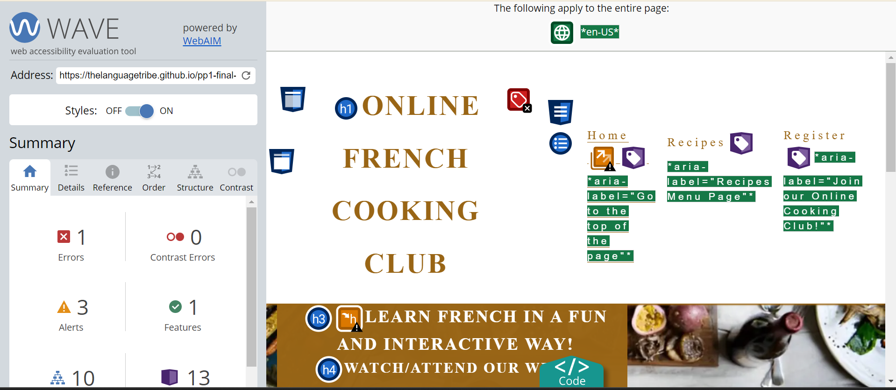

### HTML Validator
https://validator.w3.org/ 

#### First HTML Page (Home Page)

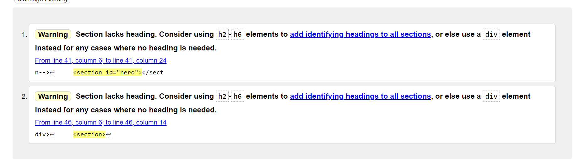

#### Second HTML Page (Recipes Gallery Page)

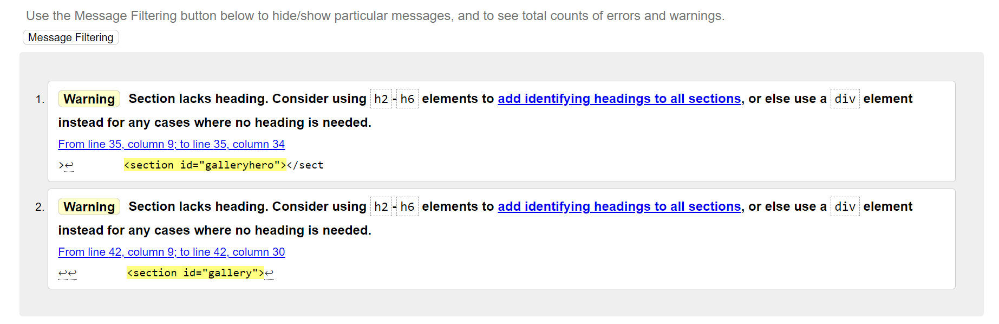

#### Third HTML Page (Registration Page)

### CSS Validator
https://jigsaw.w3.org/css-validator/

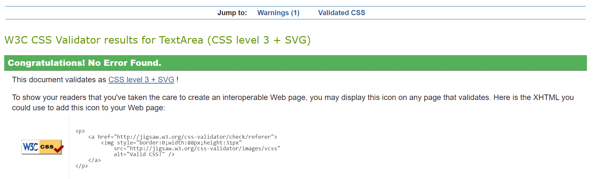

### Lighthouse Reports

#### Home Page
##### Mobile Lighthouse Report

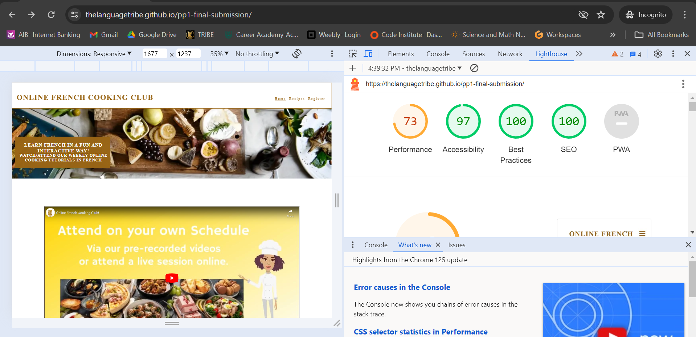

##### Desktop Lighthouse Report

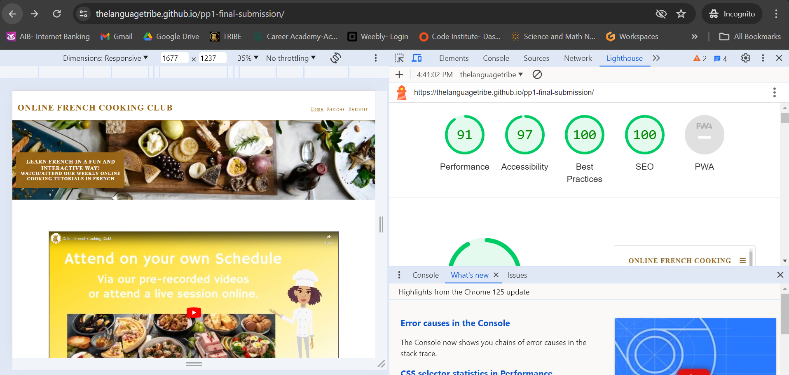

#### Recipes Gallery Page
##### Mobile Lighthouse Report

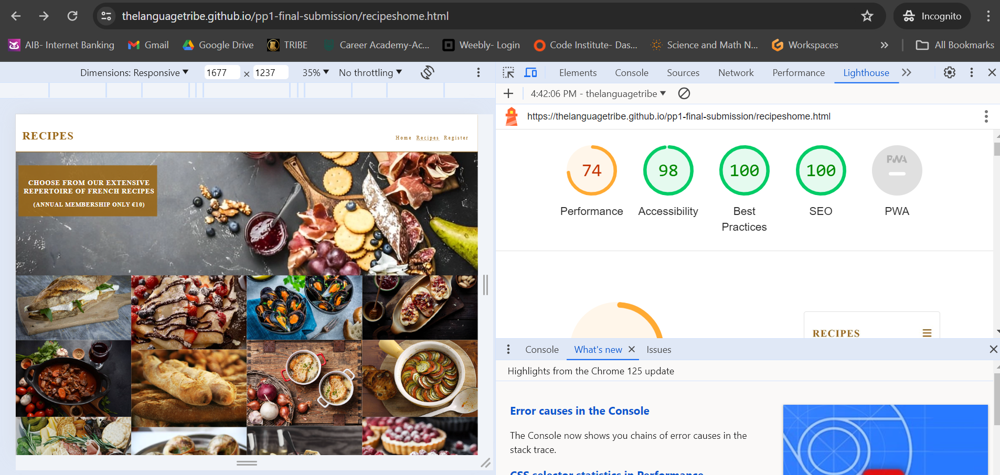

##### Desktop Lighthouse Report

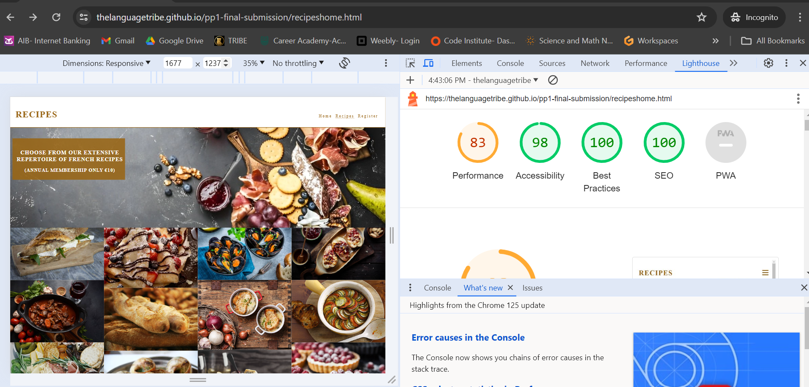

#### Registration Page
##### Mobile Lighthouse Report

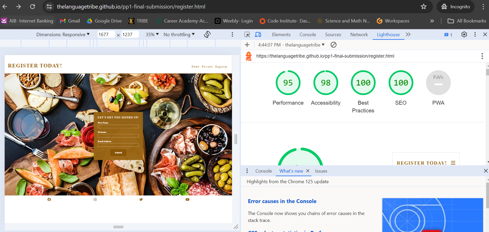

##### Desktop Lighthouse Report

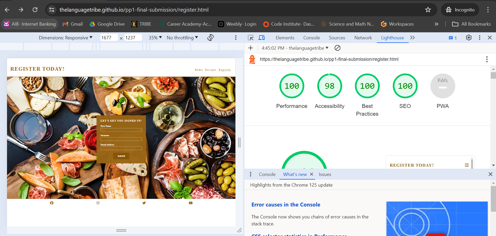

## Section 8: Credits
(use bullet points)