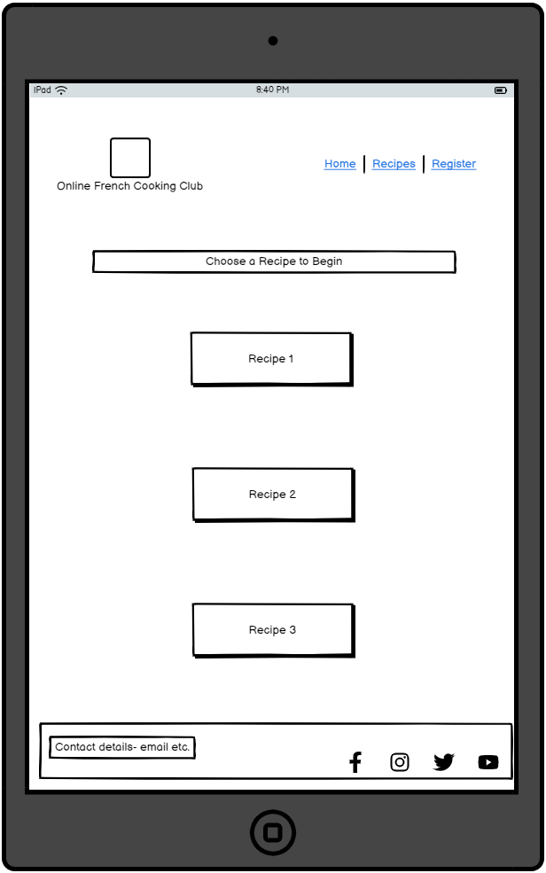
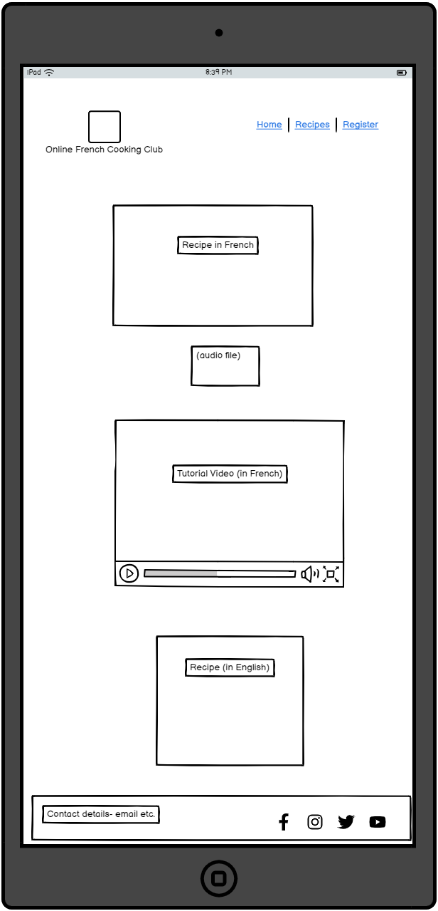
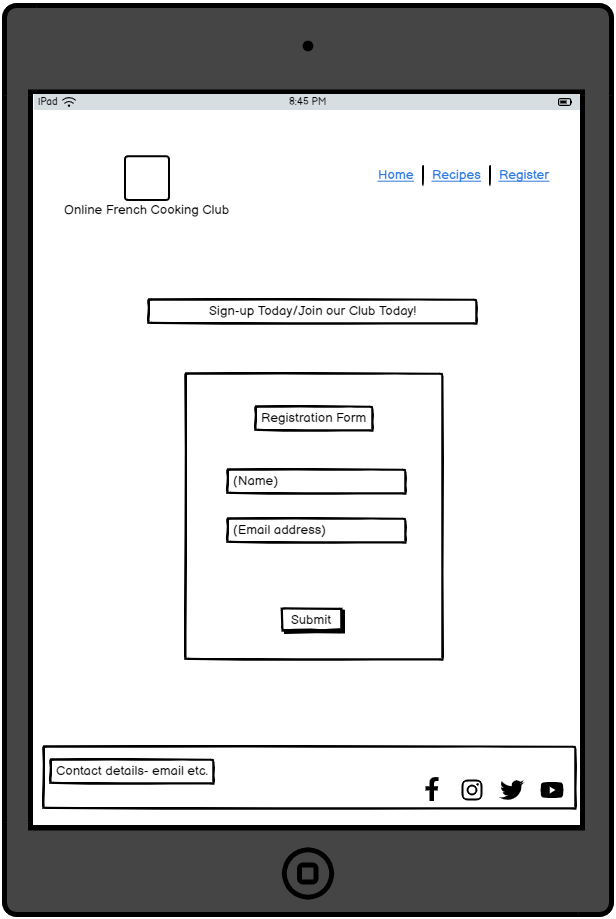
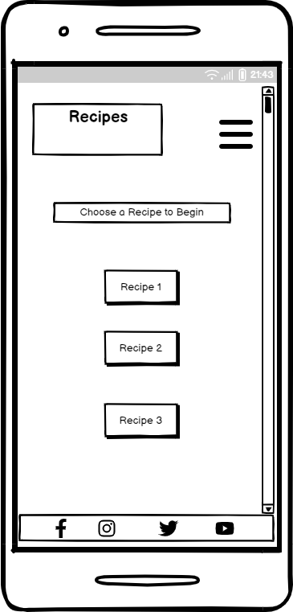
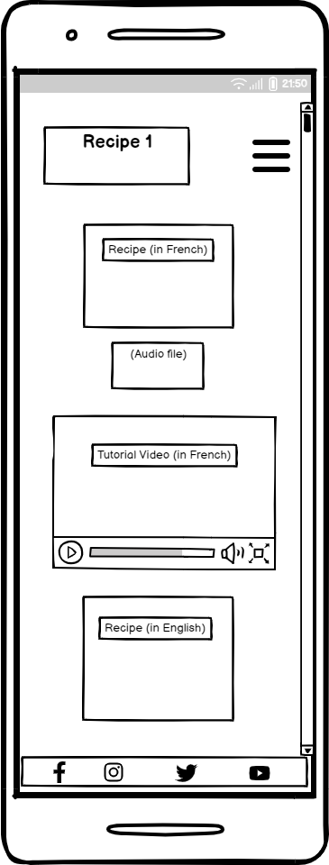
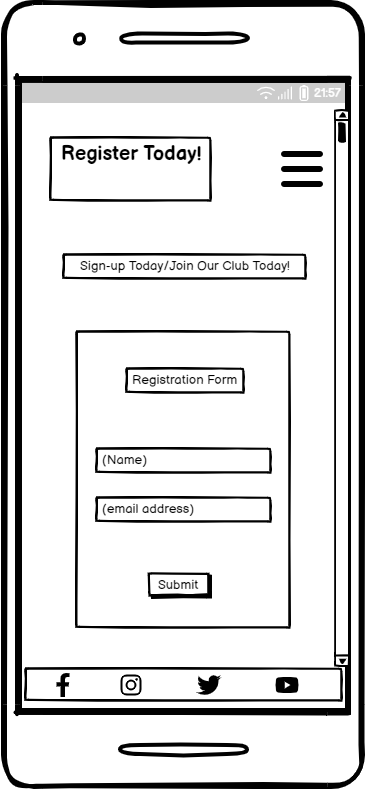
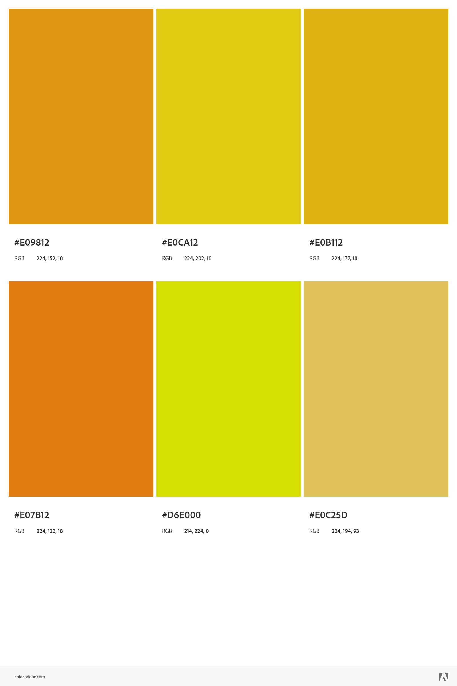
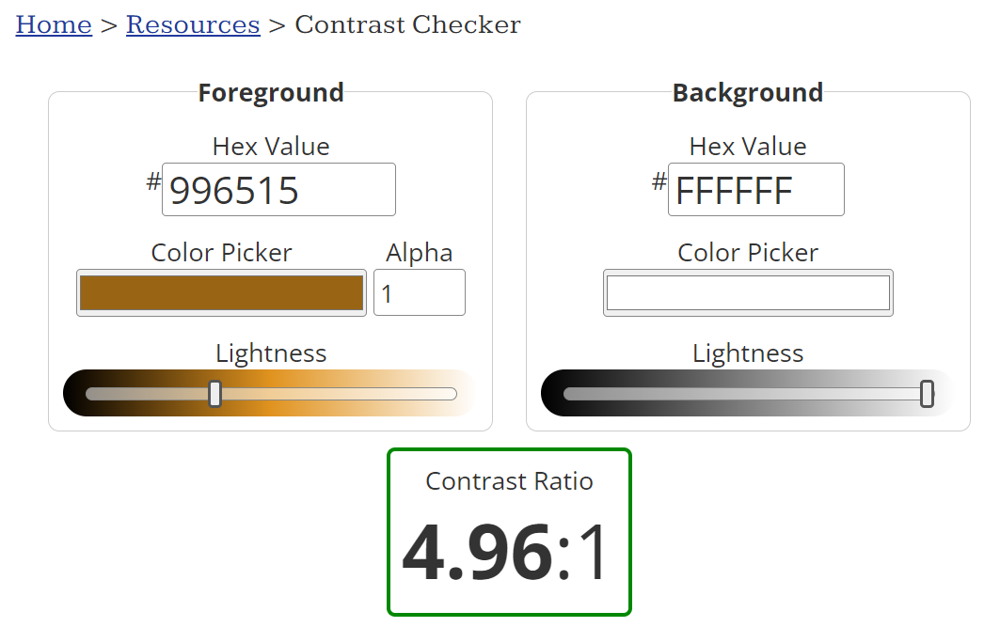
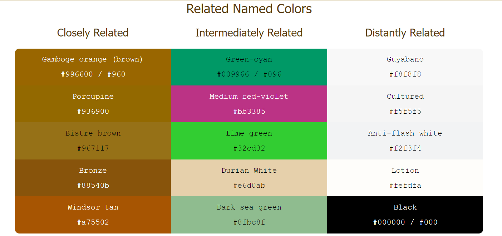
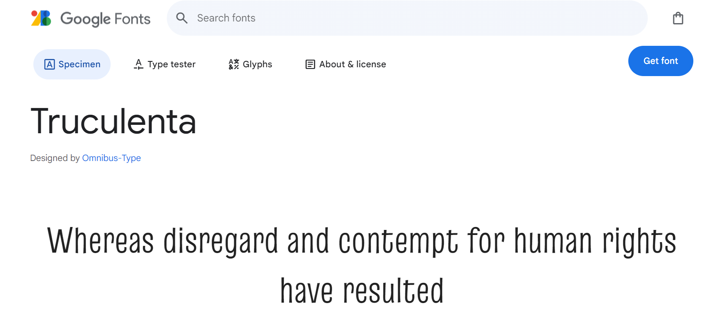

# Online French Cooking Club

 

## Table of Contents
[Link to live website](https://thelanguagetribe.github.io/pp1-final-submission/)
- [Section 1: Introduction](https://github.com/Thelanguagetribe/pp1-final-submission?tab=readme-ov-file#section-1-introduction)
- [Section 2: User Experience](https://github.com/Thelanguagetribe/pp1-final-submission?tab=readme-ov-file#section-2-user-expereience) 
[i. Strategy Plane](https://github.com/Thelanguagetribe/pp1-final-submission?tab=readme-ov-file#i-strategy-plane)
- [Section 3: User Design](https://github.com/Thelanguagetribe/pp1-final-submission?tab=readme-ov-file#section-3-design) 
[ii. Scope Plane](https://github.com/Thelanguagetribe/pp1-final-submission?tab=readme-ov-file#ii-scope-plane) 
[iii. Structural Plane](https://github.com/Thelanguagetribe/pp1-final-submission?tab=readme-ov-file#iii-structural-plane) 
[iv. Skeletal Plane](https://github.com/Thelanguagetribe/pp1-final-submission?tab=readme-ov-file#iv-skeletal-plane) 
[Wireframes](https://github.com/Thelanguagetribe/pp1-final-submission?tab=readme-ov-file#desktop-wireframes) 
[v. Surface Plane](https://github.com/Thelanguagetribe/pp1-final-submission?tab=readme-ov-file#v-surface-plane) 
- [Section 4: Features](https://github.com/Thelanguagetribe/pp1-final-submission?tab=readme-ov-file#section-4-features) 
[i. Features of the Website](https://github.com/Thelanguagetribe/pp1-final-submission?tab=readme-ov-file#i-features-on-the-website) 
[ii. Features to be implemented in the Future](https://github.com/Thelanguagetribe/pp1-final-submission?tab=readme-ov-file#ii-features-to-be-implemented-in-the-future) 
- [Section 5: Technologies Used](https://github.com/Thelanguagetribe/pp1-final-submission?tab=readme-ov-file#section-5-technologies-used) 
[i.Main Languages](https://github.com/Thelanguagetribe/pp1-final-submission?tab=readme-ov-file#i-main-languages) 
[ii. Frameworks, Libraries & Programmes](https://github.com/Thelanguagetribe/pp1-final-submission?tab=readme-ov-file#ii-frameworks-libraries--programmes) 
- [Section 6: Deployment & Local Development](https://github.com/Thelanguagetribe/pp1-final-submission?tab=readme-ov-file#section-6-deployment--local-development) 
- [Section 7: Testing](https://github.com/Thelanguagetribe/pp1-final-submission?tab=readme-ov-file#section-7-testing) 
[Manual Testing](https://github.com/Thelanguagetribe/pp1-final-submission?tab=readme-ov-file#manual-testing) 
[Validator Tools](https://github.com/Thelanguagetribe/pp1-final-submission?tab=readme-ov-file#validator-tools) 
[i. Website Contrast Checker](https://github.com/Thelanguagetribe/pp1-final-submission?tab=readme-ov-file#website-contrast-checker) 
[ii. HTML Validator](https://github.com/Thelanguagetribe/pp1-final-submission?tab=readme-ov-file#html-validator) 
[iii. CSS Validator](https://github.com/Thelanguagetribe/pp1-final-submission?tab=readme-ov-file#css-validator) 
[iv. Lighthouse Reports](https://github.com/Thelanguagetribe/pp1-final-submission?tab=readme-ov-file#lighthouse-reports) 
- [Section 8: Credits](https://github.com/Thelanguagetribe/pp1-final-submission?tab=readme-ov-file#section-8-credits) 
## Section 1: Introduction
The Online French Cooking club is a virtual cooking club designed to help French language learners and francophines improve their French in a dynamic, interactive and pragmatic way.

The recipes and cooking tutorials are conducted primarily in French as a means to help improve our users' comprehension of the language through its real-life application, beyond the parameters of conventional textbooks.

The objective of the website is to help users gain experience and practice, in both the French Language and its accompanying culture, and to begin thinking like a true French native speaker.
## Section 2: User Expereience
### i. Strategy Plane
#### Market Research
I actually came up with this idea in 2020 when I was in college. It was part of my greater business concept of a language connection service that matched language learners with native speakers (either in-person or online) and that focused on imrpoving the learning of a language by focusing on the culture affiliated with that language and diving straight into some real world experience. This business concept I called 'Tribe' and one of the limbs of its business model was to hold online events, as during the height of the COVID-19 pandemic, the popularity of online events surged. After participating in a few student start-up competitions at univeristy, I actually held an online French macaron cooking class, via Zoom, as a fun way to learn French. I advertised it via Faceboook primarily and had a successfull attendance of over 50 customers from countries all across the globe, spanning from Ireland, the UK, the Us, Dubai, Tunisia & Morocco.

For more information, a recording of this event can be found on my website 'the-langauge-tribe.com' which I made using a no-code website builder, Weebly. 
https://www.the-language-tribe.com/event-1--macaron-cooking-lesson.html 

I have conducted market research on businesses, adopting a similar approach, and have found several competitors in a similar field. The main competitors would be: 
i. iTalki- However this is solely a tutor connection service, that connect language learners to native speakers online. It is therefore less of an interactive experience. 
https://www.italki.com/en?utm_source=google_ads&utm_medium=search&utm_campaign=search_brand_en_italki_ESW_AU&utm_content=brand&gad_source=1&gclid=Cj0KCQjwpZWzBhC0ARIsACvjWRPPgw-jEiJ4tPQxiSAuiJKQ-nZL4Zq1iWYbYYszrF1dbHF_xHcrFpUaAmkkEALw_wcB. 
ii. With Locals- A service that will match users with local tour guides when on holiday. This is a solely, in-person experience, and therefore a little nuanced to the approach adopted for my website. 
https://www.withlocals.com/experiences/ireland/tours/?utm_source=google_ads_pmax_barcelona&gad_source=1&gclid=Cj0KCQjwpZWzBhC0ARIsACvjWRNV8cdVwEIwTWRVti_RRfBRtTQqe3LoBEcj4fJNiiBQjLUM6lEVlQwaAlUYEALw_wcB 
iii. Eventbrite- which provides a directory of paid and free online events. 
https://www.eventbrite.ie/ 

I researched the main layout conventions of my competitors websites. Similar, to iTalki, I tried to adopt a more minimal layout and style for my project.

#### User Stories
The target user for this website would be:
- Someone who has extra time and money to invest in a hobby, such as learning. This will therefore likely be someone in their mid-thirties to mid-sixties. i.e. Someone who has a consistent schedule and lifestyle.
- A user who is travelling abroad for holidays and would like to brush up on their language skills before then. 

##### First Time Visitor Goals
The goal is to have a website that is both eye-cathcing and emotionally enticing for a first-time visitor. To do this I stuck with a consistent colour scheme (of a dark brown foreground in front of a white background) along with a similar layout across all three pages.
Furthermore, I made a trailer video for the home page (using Animaker) to try and grab the full attention of a first time visitor and increase the odds of converting them into a customer lead.

#### Returning Visitor Goals
To try and improve customer retention, I kept the website simple, minimal and consistent. For returning visitors there is no new 'information saturation' that they need to worry about. The focus is soley on the business' value proposition.

#### Frequent Visitor Goals
For frequent visitors, I would need to continue working on this project to add more features such as a user profile and a fleshed out repertoire of French recipes and videos uploaded to the website. For the scope of this project, this is something that I must leave for a future date to build upon.

## Section 3: Design

### ii. Scope Plane
Building on the reasearch and data assembled from the strategy plane, I prioritized the following core features to be incorporated into this MVP version of my website:
- A brief and clear description of the value proposition, in text, on the first page as the first noticeable (and ideally eye-catching) element in the body of the first page.
- An animated tailer video, on the concept of the value proposition to grab and maintain the user's attention (and invoke a positiove emotional response).
- Social media icons fixed in the header across all three pages, with external links to their relative sites.
- Navigation links in a fixed header on each page with mobile responsive design.
- A gallery of popular French cuisine dishes on the 2nd page as a means to try and maintain hold of the user's interest.
- A registration form on the 3rd page as a call to action to try and generate and retain customer leads, before the users' leave the site.

### iii. Structural Plane
After establishing the scope plane I needed to incorporate:
- Navigation Links- to allow users to switch swifly from one page to another. For ease of access, these links were in the header that was 'fixed' and therefore accessibile to the customer when scrolling down a page as well. These navigation links were 3 simple links for each of the three web pages. Finally, I had made the navigation bar mobile response with the links collapsing into a burger menu icon when viewed on smaller devices (and therefore, decluttering the pages).
- Tailer Video- I made sure that this video does not autoplay whenever the page is loaded.
- Social Media Icons- I had the social media icons on the footer of each page. I also made sure that each icon had a link to its respective social media site, and account, when clicked on. These links were also external links for each of the 4 icons.
-Registration Form Button- When a user fills out his/her details in the registration form, on the thrid page, the submit button is linked to the code institute's form dump. I unfortuantely do not have the expertise, at this stage, to have been able to create my own database for the form details and so adopted code institute's one for the purpose of this project. I also ensured that the contrast and shade of the submit button was clearly visible from the rest of the form.

### iv. Skeletal Plane
When creating my wireframes for this website, I used my no-code website (from my start-up business 'The Language Tribe') as a starting point for inspiration. 
https://www.the-language-tribe.com/event-1--macaron-cooking-lesson.html

However, for the scope of this project (and my abilities) I had to withold many potential features in this first iteration and to be incorporated at a later stage. For example, adding a repertoire of French recipes, with video tutorials, readily available to potential users.

### Wireframes

 Desktop Wireframes

 

https://balsamiq.cloud/sj9vnze/ptrz8d9/rA818

 Tablet Wireframes 

 

https://balsamiq.cloud/sbqgqgv/pdf8jhp/r0E5E

 Mobile Wireframes 

 

https://balsamiq.cloud/sj9vnze/pho0yup

### v. Surface Plane

#### Colour Scheme
For the surface plane, I had original thought that a white background with a light gold foreground and text would look very nice.
I used the Adobe colour palette generator for this.

However, unfortunately in my first submission of this project, the feedback report highlighted that these shades of gold did not pass the colour contrast ratio test and also lead to issues with increased trasnparency and degreased legibility of the text.

Therefore, building on from the colour gold as m starting point, I searched for darker shades of gold until eventually I was in the territory of brown shades. The darker brown shades were getting closer to passing the colour contrast test.
After runninga few shades through the test, I settled upon the shade of 'golden brown' as the foreground colour for the website. This shade passed the contrast test, against the white background, with a high ratio.

I also tested colours closely related to 'golden-brown' when choosing the colour of the submit button on the registration form. I used a website called 'encycolorpedia' to find the closely related colours that compliment the golden brown.

#### Typography
I imported Google Fonts to my CSS file so that I could enjoy a greater selection of fonts and styles for my site.
After testing a few option, I opted for the font 'Truculenta' for my website.

#### Imagery
For the Imagery I kept the theme consitent to French Cusisine. I was unfortunately limited to the maximmum quality of photos as I used free image services. I got my images from (i). [Unsplash.com](https://unsplash.com/), (ii). [istockphoto](https://www.istockphoto.com/) and (iii). [Pixabay](https://pixabay.com/)

I then enhanced my images using [Fotor.com](https://www.fotor.com/).

Finally, for my hero images on all three pages, I converted my jpg files to webmp file using a [Free Online Converter](https://www.freeconvert.com/jpg-to-webp). I needed to convert my files as a means of reducing the image loading speeds and therefore improving the site's performance, as tested via the Lighthouse report in Section 7.

## Section 4: Features

### i. Features on the Website

Screen shots of the features

### ii. Features to be implemented in the future
I was being too ambitious with the idea of having 6 pages with 3 separate recipe pages. Time constraints and early stage of developing, I had to reduce it down to the standard 3 pages assigned for the project.
I applied a similar format to the Love Running project with a gallery page as my second page. 
The individual recipes pages will have to be a feature for the future, expanding on from this original website.

(use bullet points for features you want in the future e.g. recorded videos of online lessons already held)
Actual recipes like on my weebly website (with screenshots of my weebly website’s recipes or add pdf link and screen shot of a recipe).

## Section 5: Technologies Used

### i. Main Languages

HTML
CSS

### ii. Frameworks, Libraries & Programmes

(i.e. all your research)
-Coders coffeehouse project
-Love running project
-w3schools
-google dev tools
-chat gpt
-Stack Overflow
-Balsamiq
-Gitpod
-Github
-colour pattets
-images

## Section 6: Deployment & Local Development

(see other readmes)

## Section 7: Testing

### Manual Testing
(need grid)

| Action | Expected Result | Pass/Fail | Comments|
| ------ | --------------- | --------- | ---------------------- |
Nav Bar Links |When clicked on, the nav link should take the user to its designated html page | Pass | - |
|Social Media Icons | External links when clicked | Pass | - |

### Validator Tools

### Website Contrast Checker

https://wave.webaim.org/report#/https://thelanguagetribe.github.io/pp1-final-submission/

### HTML Validator
https://validator.w3.org/ 

#### First HTML Page (Home Page)

#### Second HTML Page (Recipes Gallery Page)

#### Third HTML Page (Registration Page)

### CSS Validator
https://jigsaw.w3.org/css-validator/

### Lighthouse Reports

#### Home Page
##### Mobile Lighthouse Report

##### Desktop Lighthouse Report

#### Recipes Gallery Page
##### Mobile Lighthouse Report

##### Desktop Lighthouse Report

#### Registration Page
##### Mobile Lighthouse Report

##### Desktop Lighthouse Report

## Section 8: Credits
- Code Institute- The HTML & CSS Learning Modules
- Code Institute- the Love Running Project
- Code Institute- The Coders Coffeehouse Project
- My First PP1 Submission- My first attempt. I used the same code as my base when setting up a new workspace.
https://github.com/Thelanguagetribe/PP1--Website 
- Favicon- For my customised favicon. 
https://www.flaticon.com/free-icon/cookbook_526194?related_id=483845&origin=search
- Favicon converter- Favicon.io.
https://favicon.io/favicon-converter/
- Social Media Icons- https://fontawesome.com/
- Youtube Video- customised through Animaker. 
https://www.animaker.com/
- Images- gotten through Unsplash, istock and pixabay.
https://unsplash.com/ 
https://www.istockphoto.com/search/2/image-film?phrase=French%20Cuisine 
https://pixabay.com/
- Fonts- Imported from Google Fonts
https://fonts.google.com/ 
- Image Enhancer-Fotor.com
https://www.fotor.com/ 
- Jpg to Webp File Converter- https://www.freeconvert.com/jpg-to-webp 
- Image Optimizer- Optimizilla (when I was using jpg images, before converting them to webp images). 
https://imagecompressor.com/#google_vignette 

- Wireframes- Balsamiq.com
https://balsamiq.cloud/sj9vnze/ptrz8d9/rA818
https://balsamiq.cloud/sbqgqgv/pdf8jhp/r0E5E
https://balsamiq.cloud/sj9vnze/pho0yup

- Colour Contrast Checker- Webaim.org.
 https://webaim.org/resources/contrastchecker/?fcolor=FFD700&bcolor=FFFFFF
 - Website Contrast Checker- Webaim Wave Report.
 https://wave.webaim.org/report#/https://thelanguagetribe.github.io/pp1-final-submission/register.html

- Adobe Colour Palette Generator-Golds & Brown
https://color.adobe.com/create/color-wheel
- Shades of Brown- Geeksforgeeks.org
https://www.geeksforgeeks.org/shades-of-brown/
- Golden Brown Foreground Colour- color-hex.com. 
https://www.color-hex.com/color/996515#:~:text=%23996515%20color%20RGB%20value%20is,of%20its%20RGB%20is%2021.
-Shades of Gold and Brown- Encycolorpedia.com
https://encycolorpedia.com/996515#google_vignette

 - Image Stretching Issue- Stackoverflow.com
 https://stackoverflow.com/questions/1733006/how-to-set-an-images-width-and-height-without-stretching-it

### Acknowledgments

- I would like to thank my mentor, Dick Vlaanderen, for his insightful feedback and advice.
- I would like to thank the Tutor support who helped me save countless of hours trying to arduously solve the bugs myself. 

